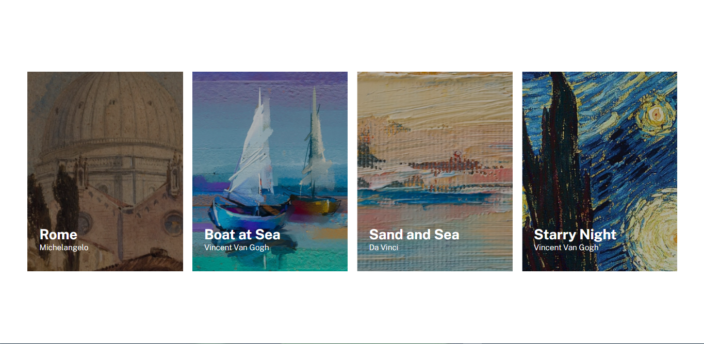

# Exercício 04 - HTML e CSS Avançado Flexbox - Lista de Imagens
No exercício, tive como objetivo criar uma lista de imagens com o título da obra e o nome do pintor.

## HTML
Para a estrutura HTML, comecei usando um elemento main para ser o container e dentro dele inseri quatro divs para serem os itens da lista.

## CSS
Usei três arquivos css para estilizar a página. O reset.css para retirar o margin e o padding dos elementos; o style.css para estilizar os elementos; e o responsive.css para deixar o site responsivo.

Fiz com que cada uma das colunas tivesse a imagem de seu título como background e adicionei uma wrap para que as colunas quebrassem para baixo conforme o espaço do container diminuia.

Para deixar responsivo igual ao exemplo do exercício, usei media queries com max-width de 425px, dessa forma, quando a resolução fosse igual eu menor a 425px, o margin do container e o gap entre as colunas vão se ajustar para a nova resolução.

## Resultado
### Desktop

### Mobile
